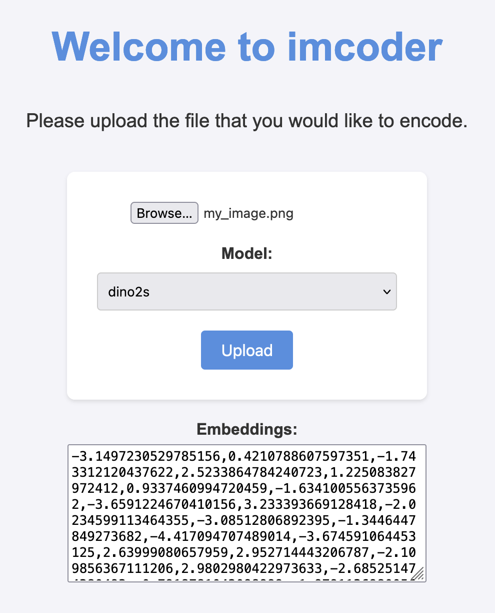

# imcoder - a friendly image encoder for cool people

Helps out by turning directories of images into arrays of feature vectors.

## To encode the images

Run the encode command in the imcoder python package with the following command, replacing the directory arguments with your input and output directories.

```bash
python imcoder encode --dirs --format=mat INPUT_DIR OUTPUT_PATH dino2 [BATCH_SIZE]
```

## Run the server that can encode over the HTTP API

To run the server from the root of the project:

```bash
flask --app imcoder.server --debug run`
```

You can then head over to `http://127.0.0.1:5000/static/index.html` to use the Web UI or call the `POST /encode` route.

The image should be passes as part of the form data of the request body.

## Screenshots


